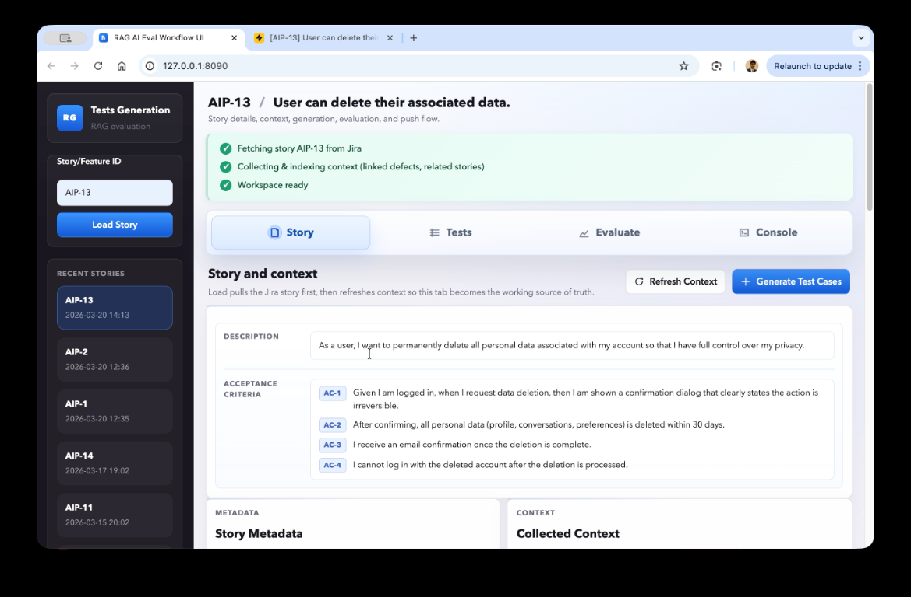
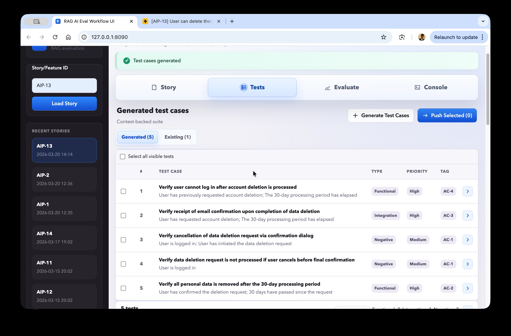
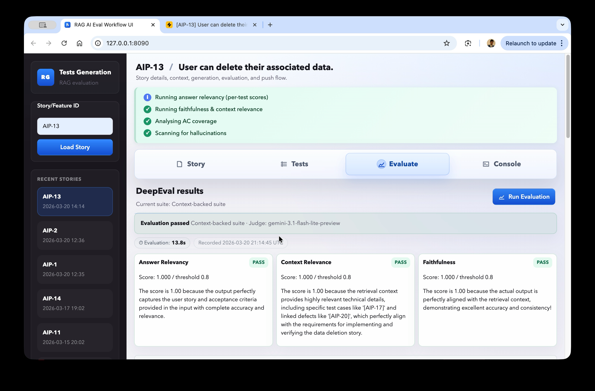
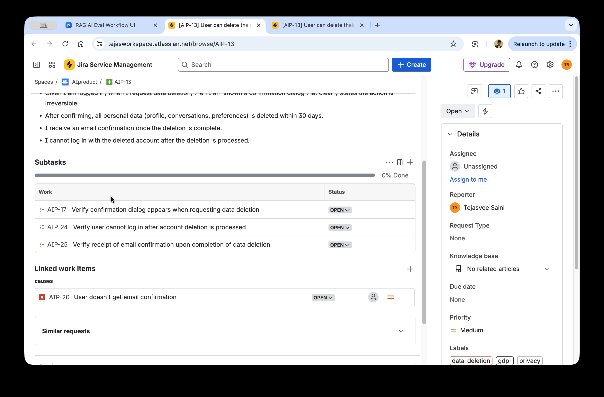

# RAG AI Eval Testcase Generator

This **UI + API project** helps **generate and evaluate QA test cases** for **Jira stories** using a **retrieval-augmented workflow** and **AI model**.

- Pulls Jira story details, gathers supporting context, generates structured test suites, and evaluates their quality.
- Includes a **browser-based workflow UI** plus supporting scripts for context refresh, test generation, evaluation, and Jira push-back.
- Works as an **end-to-end test-generation workbench**, not just a story-fetch API.

## Screenshots

#### Story loading and context collection



#### Generated test cases



#### AI Evaluation



#### Tests pushed to JIRA



## Workflow

This is the current end-to-end workflow and the tool used at each stage.

1. Load configuration.
   Tool: `pydantic-settings`
   Purpose: Reads Jira and Gemini credentials from environment-backed configuration.

2. Fetch the story from Jira.
   Tool: `httpx` + Jira REST API v3
   Purpose: Calls Jira with a reduced field set so only relevant story data is pulled.

3. Normalize the story into a stable schema.
   Tool: custom ingestor + `pydantic`
   Purpose: Converts ADF rich text to plain text, extracts acceptance criteria, and returns a stable `StoryContext` object.

4. Expose normalized story data over the API.
   Tool: `FastAPI`
   Purpose: Serves normalized story data so it can be saved locally for downstream generation.

5. Collect optional historical context from Jira.
   Tool: narrow Jira retrieval + normalization + packaging
   Purpose: Fetches linked issues and narrow JQL matches, converts them into `ContextItem`s, and builds a `ContextPackage` for retrieval-aware generation.

6. Build the Gemini prompt.
   Tool: prompt templating + strict schema instructions
   Purpose: Renders the `StoryContext`, enum constraints, hard rules, and optional `ContextPackage` into a machine-parseable generation prompt.

7. Generate test cases.
   Tool: `google-genai` / Gemini
   Purpose: Sends the prompt to Gemini, strips accidental markdown fences, parses the JSON, and validates it as `GeneratedTestSuite`.

8. Persist generated suites locally.
   Tool: CLI script + JSON
   Purpose: Reads normalized stories and writes generated suites to local JSON files.

9. Validate generated test cases.
   Tool: `pydantic` + inline gate + custom checks
   Purpose: Checks generated test cases for schema validity, enum correctness, negative-test presence, source-story consistency, and structural rules.

10. Push generated tests back to Jira.
    Tool: Jira issue creation + ADF rendering
   Purpose: Converts each generated test case into Jira ADF and creates a TestCase subtask under the parent story.


## Tech Stack

| Tool / Library | Used For | Where |
| --- | --- | --- |
| `FastAPI` | API app and story retrieval endpoint | [`src/api/app.py`](src/api/app.py), [`src/api/routes.py`](src/api/routes.py) |
| `uvicorn` | Local ASGI server | [`main.py`](main.py) |
| `httpx` | Jira GET/POST calls | [`src/jira/client.py`](src/jira/client.py), [`src/context/collector.py`](src/context/collector.py) |
| `pydantic` | Story, context, and generated-suite contracts | [`src/models/schemas.py`](src/models/schemas.py) |
| `pydantic-settings` | `.env`-backed configuration | [`src/config.py`](src/config.py) |
| Jira REST API v3 | Story retrieval, context retrieval, and issue creation | [`src/jira/client.py`](src/jira/client.py), [`scripts/push_tests.py`](scripts/push_tests.py), [`scripts/push_bugs.py`](scripts/push_bugs.py) |
| Atlassian Document Format | Jira description parsing and write-back rendering | [`src/jira/ingestor.py`](src/jira/ingestor.py), [`scripts/push_tests.py`](scripts/push_tests.py), [`scripts/push_bugs.py`](scripts/push_bugs.py) |
| `google-genai` / Gemini | Test-case generation | [`src/generation/generator.py`](src/generation/generator.py), [`src/generation/prompt.py`](src/generation/prompt.py) |
| `pytest` | API and unit tests | [`tests/api/test_health.py`](tests/api/test_health.py), [`tests/api/test_stories.py`](tests/api/test_stories.py), [`tests/jira/test_ingestor.py`](tests/jira/test_ingestor.py), [`tests/evaluation/test_gate.py`](tests/evaluation/test_gate.py) |
| `deepeval` | Planned deeper offline evaluation | [`src/evaluation/pipeline.py`](src/evaluation/pipeline.py), [`scripts/run_eval.py`](scripts/run_eval.py), [`conftest.py`](conftest.py) |

## Repository Layout

```text
.
├── data/
│   ├── context/           # Saved ContextPackage JSON
│   ├── generated/         # Gemini-generated test suites
│   ├── normalized/        # Normalized StoryContext JSON used for generation
│   ├── sample_responses/  # Reference outputs
│   └── sample_stories/    # Raw and example story fixtures
├── scripts/
│   ├── collect_context.py
│   ├── fetch_issue.py
│   ├── generate_tests.py
│   ├── push_bugs.py
│   ├── push_tests.py
│   ├── run_eval.py
│   └── run_json_eval.py
├── src/
│   ├── api/
│   ├── context/
│   ├── evaluation/
│   ├── generation/
│   ├── jira/
│   ├── models/
│   └── config.py
├── tests/
├── main.py
└── LICENSE
```

## Setup

This project includes a checked-in [`pyproject.toml`](pyproject.toml) with the main runtime dependencies. Use Python 3.11+ and install the project into a virtual environment before running the UI or scripts.

Create and activate a virtual environment, then install the project:

```bash
python3 -m venv .venv
source .venv/bin/activate
pip install -e .
```

For development tools such as `pytest`, `black`, and `ruff`, install the optional dev extras:

```bash
pip install -e .[dev]
```

Create `.env` from [`.env.example`](.env.example):

```bash
cp .env.example .env
```

Required values:

- `JIRA_BASE_URL`
- `JIRA_EMAIL`
- `JIRA_API_TOKEN`
- `GEMINI_API_KEY`

## Running Locally

Start the browser-based workflow UI:

```bash
python3 ui/server.py
```

Then open:

```text
http://127.0.0.1:8090
```

The UI supports the full working flow:

- load a Jira story
- refresh supporting context
- generate test cases
- evaluate the generated suite
- push selected tests back to Jira

If you want to run the API directly instead of the UI, you can still start it with:

```bash
python -m uvicorn main:app --reload
```

If you want to use the CLI utilities directly, the common commands are:

Fetch and save a raw Jira payload fixture:

```bash
python scripts/fetch_issue.py AIP-2
```

Collect historical context for a story:

```bash
python scripts/collect_context.py AIP-2
```

Generate test cases:

```bash
python scripts/generate_tests.py AIP-2
```

Validate generated JSON:

```bash
python scripts/run_json_eval.py AIP-2
```

Run evaluation helpers:

```bash
python scripts/run_eval.py
```

Push generated tests to Jira:

```bash
python scripts/push_tests.py AIP-2
```

Run the test suite:

```bash
pytest
```


## Learnings

These are the real lessons learned while building this system — written in plain language so they are useful to anyone picking this project up.

---

### 1. JSON correctness is not the same as quality

The first evaluation pass (schema checks, enum validation, field presence) told us the output was *structurally valid*. It did not tell us whether the test cases actually made sense for the story. A test that says "verify the system works correctly" can pass every schema check and still be useless.

**Lesson:** structural validation is a floor, not a ceiling. You need content-aware checks (like AnswerRelevancy and Faithfulness) to know if the output is actually on-topic and grounded.

---

### 2. Context helps — but it also introduces new problems

When we added historical context (linked bugs, prior test cases) to the prompt, the enriched mode generated more complete test suites — it picked up a Safari visibility test and a forbidden-characters test that baseline missed entirely.

But it also created a new failure: the model started treating context as *requirements*. It wrote tests for "Safari" and "forbidden characters" as if the current story said those things — it didn't. The story is about a chat disclaimer. Safari and forbidden characters came from linked bug reports.

**Lesson:** historical context is a hint, not a spec. If the prompt does not explicitly tell the model that context does not add new requirements, the model will assume it does.

---

### 3. "Edge Case" was silently replacing "Negative"

The prompt originally said "include at least one Negative or Edge Case test". The model consistently chose Edge Case (e.g. "verify disclaimer persists when reopened") and never produced a true Negative test (e.g. "what happens when something breaks"). Edge Case and Negative are not the same thing.

**Lesson:** never use "OR" in a requirement when you mean AND. If you need a Negative test, ask for a Negative test explicitly and close the escape hatch.

---

### 4. Forward-reference language in expected results is a red flag

One generated test had this expected result: *"The message is highly visible and correctly positioned according to the specified placement options."*

That phrase — "according to the specified placement options" — is not an observable outcome. It is a reference to a requirement that was never spelled out. A tester reading that cannot determine pass or fail.

**Lesson:** expected results must describe what a human tester can actually observe — not refer to a spec that may not exist. Add an explicit rule banning forward-reference phrases ("as specified", "per requirements", "according to spec").

---

### 5. The thinking model needs a much larger token budget

We use `gemini-3-flash-preview` as the generator. It is a thinking model, meaning it reasons internally before writing output. That internal reasoning consumes roughly 8,000 tokens that count against `max_output_tokens` — leaving very little room for the actual JSON.

Setting `max_output_tokens=8192` caused the JSON to be truncated mid-string. Setting it to `16384` fixed the problem.

**Lesson:** with thinking models, `max_output_tokens` covers both thinking tokens and visible output tokens. Always give a thinking model at least double the headroom you would give a non-thinking model.

---

### 6. Use a cheap non-thinking model as the judge

For evaluation (AnswerRelevancy, Faithfulness), we use a separate judge model: `gemini-3.1-flash-lite-preview`. The generator and the judge are deliberately different models.

Using the thinking model as its own judge would be slow and expensive. The judge only needs to classify statements — it does not need to reason deeply. A lightweight model is accurate enough and much cheaper for that task.

**Lesson:** keep the generator and the judge as separate models. Pick the cheapest model that can reliably classify text for the judge role.

---

### 7. Inspect failures before fixing the prompt

After running content-aware checks, the instinct is to immediately rewrite the prompt. We did not do that. First, we ran a failure taxonomy inspector that categorised every problem into named buckets: CONTEXT_OVERREACH, MISSING_NEGATIVE, UNSUPPORTED_ASSUMPTION, and so on.

That step revealed that most enriched-mode problems were one root cause (context bleeding into spec) — not three separate problems. Without the taxonomy, we would have made three separate prompt changes instead of one focused one.

**Lesson:** classify failures first, fix second. Random prompt tweaking without a taxonomy leads to regressions — you fix one thing and break another without knowing why.

---

### 8. Jira API quirks you will hit immediately

- `issuelinks` is not allowed on issue creation. You must create the issue first, then POST to `/rest/api/3/issueLink` separately.
- Every description field must use Atlassian Document Format (ADF). Passing a plain string returns a 400 error.
- ADF heading nodes (like "Steps to Reproduce") are very short strings — if you try to extract the first meaningful sentence from an ADF description, you will accidentally extract the heading instead. Filter for lines of at least 20 characters.

---

### 9. `GOOGLE_API_KEY` silently overrides `GEMINI_API_KEY` in deepeval

When both environment variables are set, deepeval's `GeminiModel` picks up `GOOGLE_API_KEY` first, ignoring the `api_key` constructor argument. If your `GOOGLE_API_KEY` does not have Gemini quota, every evaluation call fails with a 429.

**Fix:** explicitly remove `GOOGLE_API_KEY` from the process environment before constructing the judge model, or ensure only one key is set.

---

## Next Steps

- Fetch related development code so the system can derive richer implementation-aware scenarios and create more test cases.
- Expose generation and evaluation through a cleaner public API in addition to the workflow UI.
- Tighten prompt rules further to reduce invented AC tags and unsupported assumptions at generation time.
- Expand automated evaluation coverage with more focused metrics and regression fixtures.
- Add more end-to-end tests around the UI workflow, generation flow, and Jira push path.
